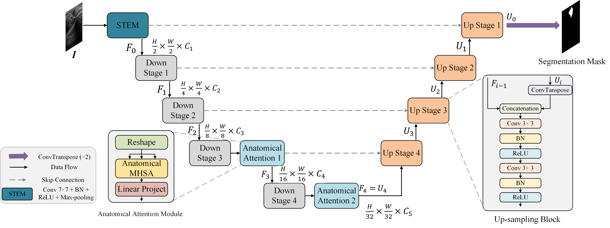

# AnatoSegNet: Anatomy-Based CNN-Transformer Network for Enhanced Breast Ultrasound Image Segmentation

Official PyTorch code for ISBI 2025 **paper** "AnatoSegNet: Anatomy-Based CNN-Transformer Network for Enhanced Breast Ultrasound Image Segmentation".

[Paper (link will be available later)] | [Code](https://github.com/YourUsername/AnatoSegNet)

[//]: # (**News** 🎉:)

[//]: # (- **AnatoSegNet is accepted by ISBI 2025!** 🥳)

[//]: # (- **Code is released now!** 🚀)

## Introduction

Accurate segmentation of breast tumor boundaries is essential for effective breast cancer diagnosis. Many convolutional and transformer-based models have been proposed for the semantic segmentation of Breast UltraSound (BUS) images. However, transformer-based segmentation models are challenging to train on small medical datasets, and breast anatomical information is rarely incorporated into these models to enhance their performance. In this study, we propose AnatoSegNet, a novel hybrid network that integrates a CNN-based U-shaped architecture with a novel breast Anatomical Attention Module for BUS image segmentation. The proposed attention module introduces a novel differential transformer and a bias matrix that emphasizes the layer structure of BUS images while capturing long-range dependencies, thereby improving the network's feature extraction capabilities. The proposed model is evaluated on two public BUS image datasets and achieves superior tumor IoU and F1 scores compared to state-of-the-art methods.

### AnatoSegNet Architecture:



## Datasets

Please organize the datasets from [TCIA Breast Lesions](https://www.cancerimagingarchive.net/collection/breast-lesions-usg/) and [BUSI](https://www.kaggle.com/datasets/aryashah2k/breast-ultrasound-images-dataset) as follows. Only images with tumors (benign or malignant) are used; normal images are excluded.

```
├── data
    ├── Dataset_BUSI_with_GT
        ├── images
        |   ├── benign (10).png
        │   ├── malignant (17).png
        │   ├── ...
        └── labels
            ├── benign (10).png
            ├── malignant (17).png
            ├── ...
    ├── your dataset
        ├── images
        |   ├── case1.png
        │   ├── case2.png
        │   ├── ...
        └── labels
            ├── case1.png
            ├── case2.png
            ├── ...
```
## Usage

### Train the Model

To train the proposed **AnatoSegNet**, simply run the `train.py` script:

```bash
python train.py
```

### Save Segmentation Results and Evaluation
To visualize, save segmentation results, and evaluate on the test set, simply run the show_result.py script:
```bash
python show_result.py
```
## Acknowledgements

This project builds upon open datasets from TCIA and BUSI. We also acknowledge the [Medical-Image-Segmentation-Benchmarks](https://github.com/FengheTan9/Medical-Image-Segmentation-Benchmarks) GitHub repository for providing helpful resources and inspiration for this work.

## Citation

If you use AnatoSegNet, please cite our paper: (available after ISBI conference)